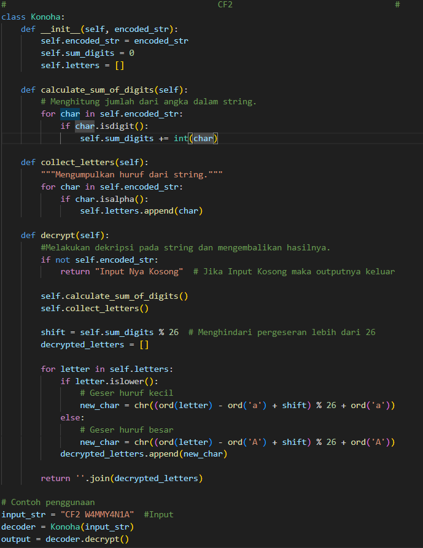
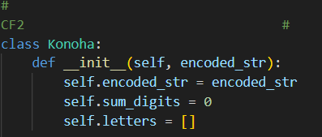

## 1.KONSEP OOP

OOP (Object-Oriented Programming) adalah paradigma pemrograman yang berfokus pada objek-objek yang merepresentasikan entitas dunia nyata. Setiap objek berisi data (atribut/properti) dan fungsi (metode) yang berkaitan dengan objek tersebut. Sedangkan OOP tradisional sering kali lebih ketat dalam hal struktur dan tipe data, Sehingga mendeklarasikan tipe data dan mengimplementasikan interface dengan ketat.

A. Konsep Dasar OOP

1. Encapsulation
   Encapsulation adalah salah satu konsep dasar OOP yang menyembunyikan detail suatu objek dari akses luar. Encapsulation membantu dalam menciptakan kode yang lebih aman dengan mencegah modifikasi data yang tidak disengaja.

2. Inheritance
   Inheritance adalah mekanisme dalam OOP yang memungkinkan suatu objek mewarisi properti dan metode dari objek induknya. Inheritance memungkinkan terciptanya hubungan antara objek yang memiliki karakteristik dan perilaku yang sama. Dengan mengatur objek ke dalam subkelas berdasarkan karakteristik yang sama, seorang programmer dapat membuat basis kode yang dapat digunakan berulang kali.

3. Polymorphism
   Polymorphism merupakan kemampuan objek untuk mengambil bentuk yang berbeda atau memiliki banyak perilaku, tergantung pada konteks penggunaannya. Polymorphism memfasilitasi pemrograman yang lebih fleksibel, karena objek dapat digunakan dalam berbagai konteks berbeda sambil tetap berperilaku yang sesuai.

4. Abstraction
   Abstraction adalah praktik menyederhanakan sistem yang kompleks dengan memecahnya menjadi bagian-bagian yang lebih kecil dan lebih mudah dikelola. Dengan meringkas detail dari sebuah objek, seorang programmer dapat menyederhanakan suatu desain program.

B. Perbedaan OOP
Berikut Penjelasan Tentang Perbedaan OOP dibandingkan paradigma Procedural:

1. Pendekatan Konsseptual : Data Vs Prosedur

- OOP :Berbasis objek yang merepresentasikan entitas dunia nyata. Setiap objek memiliki data (atribut) dan perilaku (metode) yang saling terintegrasi. Fokusnya adalah pada pengorganisasian data dan cara data tersebut dimanipulasi oleh objek.
- Prosedural: Fokus pada fungsi sebagai unit utama dan alur eksekusi logis. Data bersifat global atau terpisah dari fungsi, sehingga manipulasi data dilakukan secara langsung melalui fungsi.

1. Konsekuensi Teknik

- Dalam OOP, abstraksi mempermudah pemodelan sistem kompleks karena data dan fungsi digabung dalam satu kesatuan (kelas/objek).
- Dalam prosedural, fokus logika membuatnya sulit memodelkan hubungan kompleks antara data dan perilaku.

2. Struktur Kode: Hierarki vs Linearitas

- OOP: Memanfaatkan hierarki kelas untuk pengorganisasian kode. Hubungan antar kelas dapat berupa pewarisan (inheritance) atau asosiasi (misalnya, satu objek memiliki objek lain sebagai atribut).
- Prosedural: Struktur kode bersifat linear, di mana fungsi saling memanggil berdasarkan alur eksekusi.

3. Reusability dan Modularitas

- OOP: Menggunakan pewarisan dan komposisi untuk mendukung penggunaan ulang kode. Subclass dapat menambahkan atau mengubah perilaku dari superclass tanpa memodifikasi kode yang ada.
- Prosedural: Reusability biasanya bergantung pada fungsi yang terpisah, tetapi sulit untuk membuatnya modular dalam sistem besar karena logika fungsi sering bercampur dengan manipulasi data.
- Contoh OOP yang termasuk reusability pewarisan dari Tugas 3 (Konoha_Encripe.py)
  

## 2.CLASS & OBJECT

A. CLASS
Class adalah prototype, atau blueprint, atau rancangan yang mendefinisikan variable dan method-methode pada seluruh objek tertentu. Class berfungsi untuk menampung isi dari program yang akan di jalankan, di dalamnya berisi atribut / type data dan method untuk menjalankan suatu program.

B. OBJECT
Object adalah instance dari class. Jika class secara umum mepresentasikan (template) sebuah object, sebuah instance adalah representasi nyata dari class itu sendiri.

## 3.ATTRIBUTE

Attribute dalam konsep Object-Oriented Programming (OOP) merujuk pada variabel yang ada dalam sebuah kelas dan berfungsi untuk menyimpan data atau status objek tersebut. Atribut adalah properti atau ciri khas yang dimiliki oleh objek dari kelas tersebut. Setiap objek dapat memiliki nilai atribut yang berbeda. Atribut yang didefinisikan dalam metode **init**() (konstruktor).

## 4.METHOD

Method dalam Object-Oriented Programming (OOP) adalah fungsi yang didefinisikan di dalam sebuah kelas dan biasanya beroperasi pada atribut objek atau kelas tersebut. Method mendefinisikan perilaku atau tindakan yang dapat dilakukan oleh objek yang dibuat dari kelas tersebut.Contoh Di Tugas Ke 3 (konoha_encripe.py).

## 5.CONSTRUCTOR

Constructor adalah sebuah metode khusus dalam pemrograman berorientasi objek (OOP) yang digunakan untuk menginisialisasi objek baru dari sebuah kelas. Constructor ini dipanggil secara otomatis ketika objek dibuat. Biasanya, constructor digunakan untuk menetapkan nilai awal dari atribut objek.

A. Penjelasan tentang Constructor:

1. Fungsi Utama:
   Constructor digunakan untuk mempersiapkan objek dengan memberikan nilai awal kepada atribut-atribut yang ada di dalam kelas. Dengan begitu, objek tersebut siap digunakan setelah dibuat.

2. Penyusunan Constructor:
   Pada Python, constructor adalah metode khusus yang bernama **init**(). Method ini akan dipanggil secara otomatis saat Anda membuat objek baru dari kelas

3. Sintaks pada Constructor :
   

- self : Mengacu pada objek itu sendiri (instansi kelas)
- didalam constructor ada atribut encoded_str adalah nilai yang diteruskan ke constructor ketika objek dibuat.

## 6.ACCESS MODIFICATION

Access Modification dalam konteks Object Oriented Pemograman (OOP) mengacu pada cara mengontrol akses terhadap atribut dan metode dalam sebuah kelas. Tujuan dari modifikasi akses adalah untuk melindungi data dan memastikan bahwa hanya bagian yang relevan dari kode yang dapat mengakses atau memodifikasi data tersebut. Ada tiga tingkat akses utama dalam OOP: public, protected, dan private.

1. Public
   Atribut atau metode yang bersifat public dapat diakses dari mana saja: baik dari dalam kelas itu sendiri, objek, maupun luar kelas.
   Ini adalah tingkat akses yang paling terbuka dan tidak ada batasan dalam mengaksesnya.
2. Protected
   Atribut atau metode yang bersifat protected hanya dapat diakses oleh kelas itu sendiri dan subclass (kelas yang mewarisi kelas ini).
   Akses dari luar kelas atau objek tidak disarankan, meskipun masih memungkinkan dalam beberapa bahasa pemrograman.
3. Private
   Atribut atau metode yang bersifat private hanya dapat diakses oleh kelas itu sendiri.
   Akses dari luar kelas atau subclass sangat dibatasi, bahkan dalam banyak bahasa pemrograman, atribut private tidak dapat diakses langsung dari luar kelas sama sekali.

   ~supported By~

   
   
